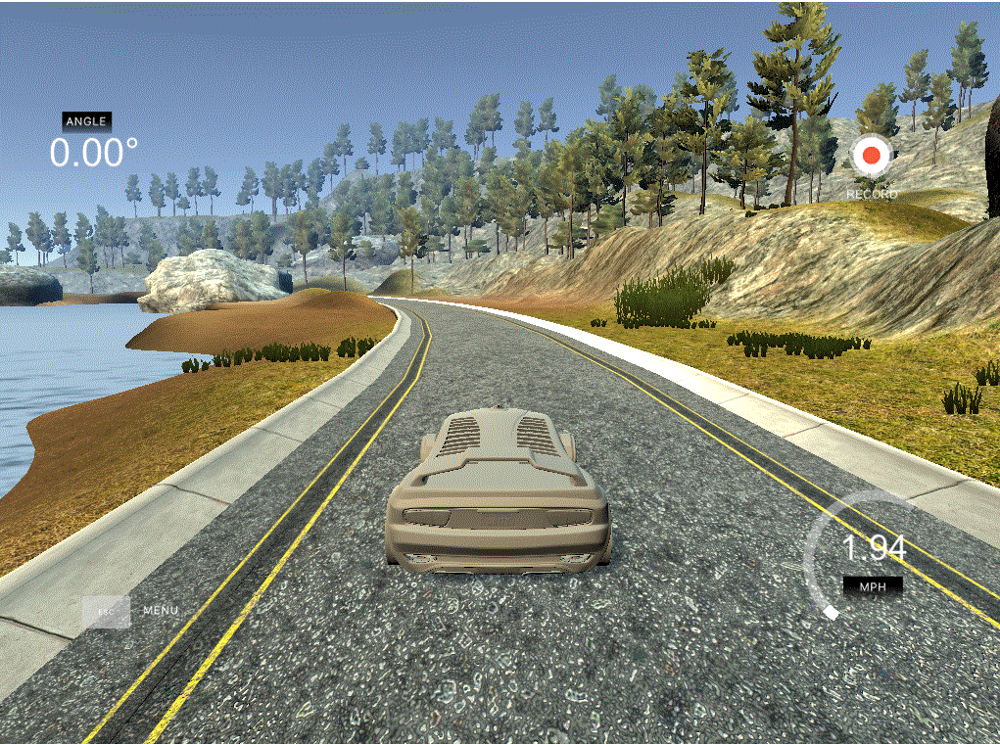
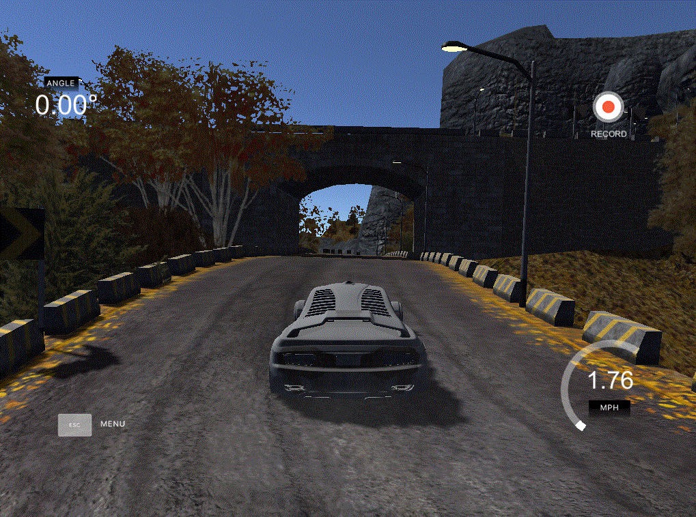
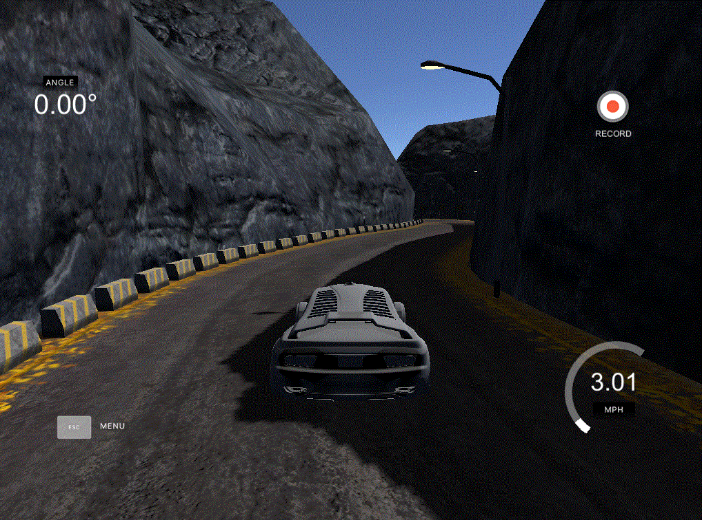

# End-to-End Steering Control Mechanism
 The project self-driving (autonomous) vehicle end-to-end steering control system, uses Udacity's open-source CarNd simulator to implement end-to-end steering control mechanism using deep learning.

## How to use:


1. Visit official simulator repo https://github.com/udacity/self-driving-car-sim and download the CarNd simulator.
2. Press the record button in training mode and extract out the frames as per the requirements from 3 different camaras along with mapped file. Frames will be saved in ./IMG and mapped csv file in ./ directory respectively.
3. Use anaconda environment
4. Install all the requirements from ```requirements.txt``` file by typing ```pip install -r requirements.txt```
5. Initially start the simulator in training mode, click on record button, collect the image dataset (collected from 3 different cameras fixed on our simulated car)
6. Check the IMG folder having image dataset, and also check driving_log.csv (consisting path of 3 images at a time and intensity of L R A B respectively)
7. Run the model.py file, which consist our CNN model (feel free to edit and experiment)
8. Once model trained, open the simulator in autonomous mode, and in anaconda environment type ```python drive.py <model.h5>```, for reference you can also use ```driving_model.h5```
9. If Model to be trained on Google Colab then use ```model-nv.ipynb``` file

## Simulator Images:




**************************************



**************************************




